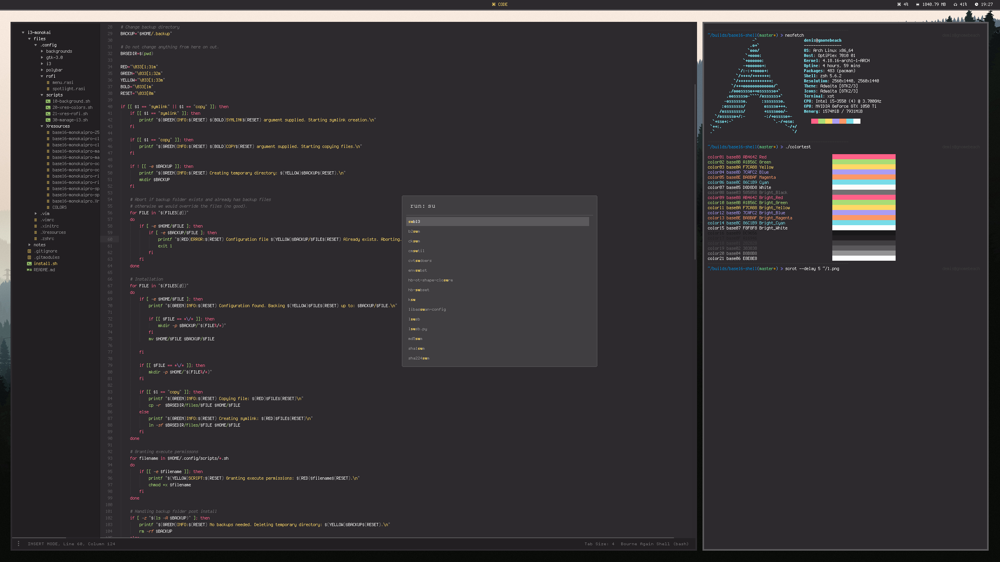

# Yairs

**Yairs** [(Y)et (a)nother (i)3 (r)ice (s)etup] is what I call my dotfiles repository. It is a working process - basically it will probably never be finished. However, everone is welcome to use it fully or partially.
yairs is a i3 setup using bitmap fonts based around the [Monokai Pro](https://www.monokai.pro) colour palette created by [Wimer Hazenberg](https://www.monokai.nl).

#### Prerequisites
+ i3-gaps
+ polybar
+ Rofi
+ a 256-color terminal (I use [xst](https://github.com/gnotclub/xst))

#### Fonts
+ Misc Termsyn
+ Wucon Siji
+ Liberation (going to change)

#### Synopsis
***
I use i3-gaps as my wm and polybar as my bar (I will likely change the current polybar setup in the future).
One of Yairs' feature is, that there is (at the moment) only one point of entry in terms of configuration: `.Xresources`.
On top of that I have written easy-to use installation and maintenance shell scripts. The user is able to change 
between the many Monokai Pro flavours on the fly using the `$mod+shift+s` shortcut.

#### Installation
***
Clone the repo

    cd ~

    git clone https://github.com/minikN/i3-monokai.git yairs

Please not that the dir you clone into is up to you. However I suggest it being somewhere in your home folder.
I've written a simple [shell script](https://github.com/minikN/i3-monokai/blob/master/install.sh) to help with copying / linking
all the file. In oder to use it, you have to grant it execute permissions:

    chmod +x ~/yairs/install.sh

After that you can run it with `sh install.sh`.

**First and foremost**: The script does not override any of your files. It scans the directory it needs to copy files to.
if you already have files it needs to replace (e.g. `.Xresources` or `.vimrc`) it will create a backup directory
(default is `~/.backup`) and copy your default files to this directory. You can change the backup directory in the script.

Before you run it, you should open it in your favorite text editor and review the files array and the backup variable at 
the top. You can adjust the array to only use the files you want. Keep in mind that some features may not work if you exclude
certain files.

If you run the script with no argument supplied, it will print a little help menu to guide you. There are basically 3 arguments
you can choose from

    sh install.sh copy

The copy argument copies every file/folder you supplied in the files array to your home dir. If you already happen to have a
file the script wants to copy, it will copy it in the backup dir you supplied (if, for some reason, the backup dir also 
already hosts the same file, the script will immediately abort. By the way: It will check this for every file before trying
to copy even one. So it only start copying once it's checked it won't override anything).

    sh install.sh symlink

Recommended approach, does the same as copy, the difference being it only creates symbolic links instead of hard copying the
files. This makes it easy to update the repo.

    sh install.sh clean

Reverts everything back to normal. In case it backed up some file, it will restore them as well.

More to come.